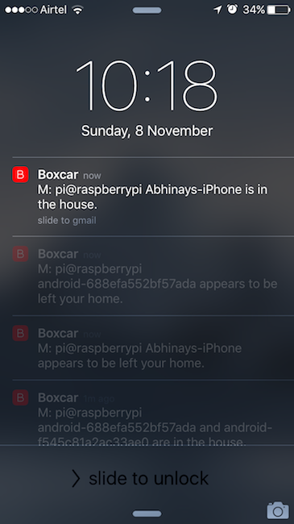

# Whois Home

Get a notification on your iPhone/Android when someone enters or leaves your home. Currently running on my RasberryPi machine.

`nmap` command to display all devices which are currently connected to wifi network / router.

    $ nmap -sP 192.168.1.0/28 | grep report | awk '{print $5}'
    D-Link123.Home
    Abhinays-iMac.Home
    Abhinays-iPhone.Home
    raspberrypi.Home
    android-4b5451e9e51fd693.Home

To start the SMTP mail server on Mac

    sudo launchctl start org.postfix.master on Mac

To configure mail server on Rasbian (Debian)

    dpkg-reconfigure exim4-config

Prerequisites

* [Boxcar](https://boxcar.io)
* npm

Author
------

Abhinay Omkar
